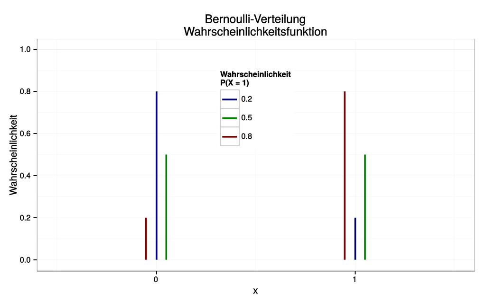

# Naive Bayes Classifier

**Category**: Supervised Learning - Probabilistic Model, Binary-Classification

**Examples**: Spam-Classification, Filtering

$$P(spam | message) = P(spam | \vec{w}), \vec{w}$$ = list of words/token

**Bayes Theorem**

$$P(spam|\vec{w}) = \frac{P(spam) * P(\vec{w}|spam)}{P(spam) * P(\vec{w}|spam) + P(\neg spam)*P(\vec{w}|\neg spam)}$$

$P(spam)$, probability for spam message in general

$\vec{v}$ = ["wallet", "bitcoin", "Hi", "bank", "account"]
$\vec{v}$ = tokens in vocabulary 

**Example**:

$\vec{w}$ = ["wallet"]
$P(\vec{w}|spam)$ = P(wallet, not any other word|spam) = (1, 0, 0, 0, 0)

Probability Chain rule (ressource intense operation!):
$$P(\vec{v_0}, \neg \vec{v_1}, \neg \vec{v_2}, \neg \vec{v_3}, \neg \vec{v_4}| spam) = P(\neg \vec{v_4}|spam) * P(\neg \vec{v_3}|\neg \vec{v_4}, spam)* ... * P(\vec{v_0}|\neg \vec{v_4}, \neg \vec{v_3}, \neg \vec{v_2}, \neg \vec{v_1}, spam)$$ 

Assumption: presence or absence of any word is not dependent on presence or absence any other word:
$$P(\vec{v_0}, \neg \vec{v_1}, \neg \vec{v_2}, \neg \vec{v_3}, \neg \vec{v_4}| spam) = P(\neg \vec{v_4}|spam) * P(\neg \vec{v_3}|spam)* ... * P(\vec{v_0}|spam)$$
&rarr; independence of words. (Naive indepence assumption)

General probability for spam is 20 percent.

$$P(spam|\vec{w}) = \frac{0,2 * P(\vec{v_0}|spam) * P(\neg\vec{v_1}|spam) * ... * P(\neg\vec{v_4}|spam)}{0,2 * P(\vec{v_0}|spam) * P(\neg\vec{v_1}|spam) * ... * P(\neg\vec{v_4}|spam) + 0,8 * P(\vec{v_0}|\neg spam) * P(\neg\vec{v_1}|\neg spam) * ... * P(\neg\vec{v_4}|\neg spam)}$$

**Laplace-Smoothing** to make sure there is no Zero in either the nominator or denominator. Adds a 1 to the nominator and a 2 to the denominator for every probability.

**Example**

"Hey, good point here - this is interesting."
&nbsp;&nbsp;&nbsp;&nbsp;&nbsp;&nbsp;&nbsp;&nbsp;&darr; *Tokenization*
["Hey", "good", "point", "here", "-", "this", "is", "interesting"]
&nbsp;&nbsp;&nbsp;&nbsp;&nbsp;&nbsp;&nbsp;&nbsp;&darr; *Stop word removal*
["Hey", "good", "point", "-", "interesting"]
&nbsp;&nbsp;&nbsp;&nbsp;&nbsp;&nbsp;&nbsp;&nbsp;&darr; *non-alphabetical character removal*
["Hey", "good", "point", "interesting"]
&nbsp;&nbsp;&nbsp;&nbsp;&nbsp;&nbsp;&nbsp;&nbsp;&darr; *stemming*
["Hey", "good", "point", "interest"]

**Stemming:** 
Studying &rarr; Study
Studies &rarr; Studi

**Lemmatization:** &rarr; more expensive operation
Studying &rarr; Study
Studies &rarr; Study

lower-casing looses understanding of nouns, names for NER (Named-Entity-Recognition)

*Prior*: indicates the probability of a particular class regardless of any features
*Likelihood*:the probability of some features given a particular class
*Posteria*: the probability of a class given some features

$$P(spam|\vec{w}) = P(spam) * P(\vec{w}|spam)$$

OR in case of probabilities is addition
AND in case of probabilites is multiplication

**Bernoulli-Distribution:**
